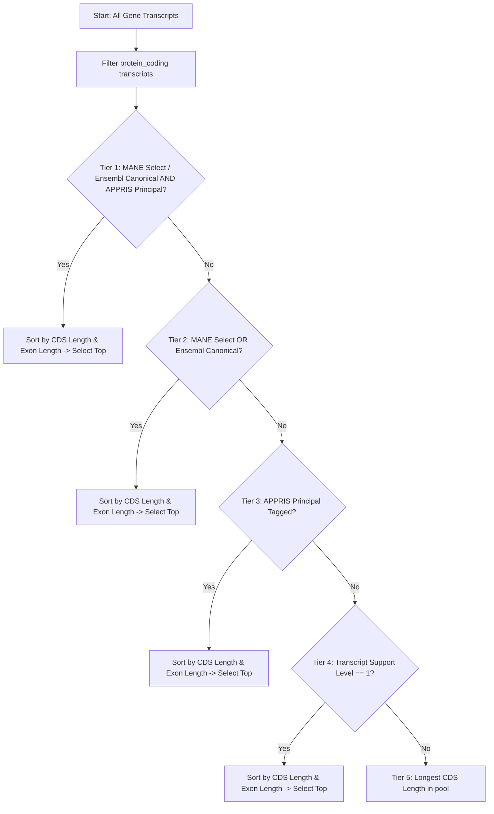

# GENCODE v46 Canonical Transcript Selection Policy

This document details the deterministic, multi-tier selection algorithm implemented in GeneCureAI (`bioinformatics/gene_selection/gene_lookup.py`) for resolving canonical transcripts from the GENCODE v46 comprehensive gene annotation.

---

## 1. Hierarchy of Selection Tiers

When multiple transcript isoforms exist for a given gene locus, GeneCureAI evaluates all protein-coding isoforms using the following priority order:

### Detailed Tier Rules

1. **Tier 1: Canonical + APPRIS Principal (Gold Standard)**
   - Must have `tag "MANE_Select"` or `tag "Ensembl_canonical"` AND `tag "appris_principal_X"`.
   - Breaks any ties by longest total CDS length (`total_cds_length`), then longest spliced mature exonic length (`total_exon_length`).
2. **Tier 2: Canonical Tagged**
   - Transcripts marked as `MANE_Select` or `Ensembl_canonical`.
3. **Tier 3: APPRIS Principal**
   - Transcripts tagged with `appris_principal_1` through `appris_principal_5`.
4. **Tier 4: High Confidence Experimental Support (TSL 1)**
   - Transcripts supported by full-length mRNA/EST alignments (`transcript_support_level "1"`).
5. **Tier 5: Maximum Coding Capacity (Longest CDS)**
   - Transcripts with the greatest coding sequence base pair length.
6. **Tier 6: Longest Exonic Length (Fallback)**
   - Longest mature transcript if CDS annotations are identical.

---

## 2. Verified Resolutions for the 9 Curated Target Genes

| Gene | Resolved Symbol | Ensembl Gene ID | Canonical Transcript ID | Selection Policy Outcome | CDS bp | Exons |
|:---|:---|:---|:---|:---|:---:|:---:|
| **BRCA1** | BRCA1 | `ENSG00000012048.26` | `ENST00000357654.9` | Tier 1 (MANE Select / Ensembl Canonical + APPRIS P1) | 5,592 | 22 |
| **HER2** | ERBB2 | `ENSG00000141736.14` | `ENST00000269571.10` | Tier 1 (Ensembl Canonical + APPRIS P1) | 3,768 | 27 |
| **TP53** | TP53 | `ENSG00000141510.18` | `ENST00000269305.9` | Tier 1 (MANE Select / Ensembl Canonical + APPRIS P1) | 1,182 | 10 |
| **EGFR** | EGFR | `ENSG00000146648.16` | `ENST00000275493.7` | Tier 1 (MANE Select / Ensembl Canonical + APPRIS P1) | 3,633 | 28 |
| **KRAS** | KRAS | `ENSG00000133703.15` | `ENST00000256078.10` | Tier 1 (MANE Select / Ensembl Canonical + APPRIS P1) | 570 | 4 |
| **ALK** | ALK | `ENSG00000171094.18` | `ENST00000389048.8` | Tier 1 (MANE Select / Ensembl Canonical + APPRIS P1) | 4,863 | 29 |
| **CTNNB1** | CTNNB1 | `ENSG00000168036.17` | `ENST00000349496.11` | Tier 1 (MANE Select / Ensembl Canonical + APPRIS P1) | 2,346 | 14 |
| **AXIN1** | AXIN1 | `ENSG00000103126.15` | `ENST00000262325.8` | Tier 1 (MANE Select / Ensembl Canonical + APPRIS P1) | 2,589 | 10 |
| **TERT** | TERT | `ENSG00000164362.21` | `ENST00000310581.10` | Tier 1 (MANE Select / Ensembl Canonical + APPRIS P1) | 3,399 | 16 |
